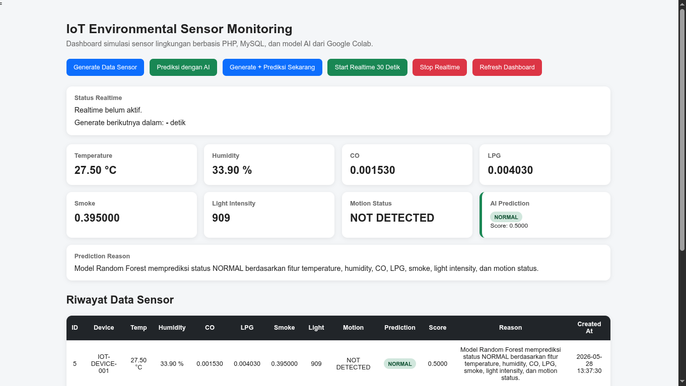

# Laporan Proyek: Sistem Monitoring Sensor Lingkungan berbasis IoT, Web, dan AI

**Nama Proyek:** IoT Environmental Sensor Monitoring System  
**Lokasi:** `/home/mamen/LAMP/www/iot-ai-sensor-system`  
**Lingkungan:** Linux, XAMPP, PHP Native, MySQL, Python  

---

## Daftar Isi

1. [Pendahuluan](#1-pendahuluan)
2. [Teknologi yang Digunakan](#2-teknologi-yang-digunakan)
3. [Arsitektur Sistem](#3-arsitektur-sistem)
4. [Hasil Uji Coba](#4-hasil-uji-coba)
5. [Analisis Integrasi Tiga Platform: IoT, Web, dan AI](#5-analisis-integrasi-tiga-platform-iot-web-dan-ai)
   - 5.1 Peran dan Fungsi Setiap Platform
   - 5.2 Alur Integrasi Antarplatform
   - 5.3 Sinergi dan Manfaat Integrasi
6. [Kesimpulan](#6-kesimpulan)

---

## 1. Pendahuluan

### 1.1 Latar Belakang

Perkembangan teknologi Internet of Things (IoT) telah membuka peluang baru dalam pemantauan lingkungan secara real-time. Sensor-sensor lingkungan — seperti suhu, kelembapan, kadar gas, intensitas cahaya, dan deteksi gerakan — dapat dipasang di berbagai lokasi untuk mengumpulkan data secara kontinu. Data yang terkumpul memerlukan pengolahan lebih lanjut agar dapat memberikan informasi yang bermakna bagi pengguna.

Di sisi lain, perkembangan kecerdasan buatan (AI) khususnya machine learning memungkinkan analisis data sensor secara otomatis. Model klasifikasi dapat memprediksi status lingkungan — normal, waspada, atau berbahaya — berdasarkan pola data historis. Namun, model AI yang telah dilatih memerlukan infrastruktur agar dapat diakses dan digunakan oleh aplikasi nyata.

Proyek ini menjawab kebutuhan tersebut dengan mengintegrasikan tiga platform teknologi: IoT (sebagai sumber data), Web (sebagai antarmuka dan middleware), dan AI (sebagai mesin inferensi). Ketiga platform tersebut dirangkai dalam satu kesatuan arsitektur yang utuh.

### 1.2 Tujuan

Tujuan proyek ini adalah sebagai berikut:

1. Membangun sistem simulasi data sensor lingkungan yang merepresentasikan perangkat IoT.
2. Menyediakan dashboard web untuk memantau data sensor dan hasil prediksi secara real-time.
3. Mengintegrasikan model machine learning (Random Forest) yang telah dilatih di Google Colab ke dalam aplikasi web.
4. Menganalisis pola integrasi antara platform IoT, Web, dan AI dalam satu sistem yang berfungsi.

### 1.3 Ruang Lingkup

Ruang lingkup proyek ini meliputi:

1. Simulasi data sensor lingkungan menggunakan PHP sebagai representasi perangkat IoT.
2. Basis data MySQL untuk menyimpan data sensor mentah dan hasil prediksi.
3. Dashboard web berbasis PHP, HTML, CSS, dan JavaScript.
4. Model Random Forest dalam format `.pkl` untuk klasifikasi status lingkungan.
5. Skrip Python sebagai jembatan antara PHP dan model machine learning.

---

## 2. Teknologi yang Digunakan

Proyek ini mengintegrasikan tiga kelompok teknologi yang masing-masing berada dalam platform IoT, Web, dan AI. Berikut adalah rincian teknologi beserta perannya dalam sistem.

### 2.1 Platform Web (Frontend dan Backend)

| Teknologi | Versi | Peran dalam Sistem |
|-----------|-------|--------------------|
| **PHP Native** | 8.x | Bahasa pemrograman backend yang memproses data sensor, berkomunikasi dengan database MySQL, memanggil skrip Python melalui `shell_exec()`, dan merender halaman dashboard. |
| **MySQL** | 8.x | Sistem manajemen basis data relasional yang menyimpan data sensor mentah dan hasil prediksi dalam tabel `sensor_data`. |
| **HTML5** | — | Bahasa markup yang membangun struktur halaman dashboard. |
| **CSS3** | — | Lembar gaya yang mengatur tata letak, warna, dan responsivitas dashboard. |
| **JavaScript (Vanilla)** | ES6 | Bahasa skrip klien yang menangani pembaruan halaman secara real-time melalui mekanisme polling AJAX setiap 30 detik. |
| **XAMPP** | 8.x | Paket server lokal yang menyediakan lingkungan Apache HTTP Server, interpreter PHP, dan MySQL dalam satu kesatuan perangkat lunak. |

### 2.2 Platform IoT (Simulasi Sensor)

| Teknologi | Peran dalam Sistem |
|-----------|--------------------|
| **PHP Native** | Bertindak sebagai generator data sensor simulasi yang menghasilkan tujuh parameter lingkungan secara acak dalam rentang nilai tertentu. Parameter tersebut meliputi temperature (25.0–42.0 °C), humidity (30.0–90.0 %), CO (0.001–0.009), LPG (0.001–0.012), smoke (0.1–0.9), light_intensity (0–1000 lux), dan motion_status (0 atau 1). |

### 2.3 Platform AI (Machine Learning)

| Teknologi | Versi | Peran dalam Sistem |
|-----------|-------|--------------------|
| **Python** | 3.12 | Bahasa pemrograman yang menjalankan skrip inferensi `ai_model/predict.py` dan memuat file model `.pkl` dari Google Colab. |
| **scikit-learn** | 1.8.0 | Pustaka machine learning yang menyediakan algoritma Random Forest untuk klasifikasi status lingkungan menjadi tiga kelas: NORMAL, WARNING, dan DANGER. |
| **pandas** | 3.0.3 | Pustaka manipulasi data yang digunakan untuk menyusun DataFrame dari input sensor sebelum proses normalisasi. |
| **numpy** | 2.4.6 | Pustaka komputasi numerik yang menjadi fondasi operasi matriks dalam proses scaling dan prediksi. |
| **joblib** | 1.5.3 | Pustaka yang memuat (load) file `model.pkl`, `scaler.pkl`, dan `label_encoder.pkl` dari sistem file. |

### 2.4 Lingkungan Pengembangan

| Komponen | Spesifikasi |
|----------|-------------|
| Sistem Operasi | Linux |
| Server Web | Apache (XAMPP) |
| Direktori Proyek | `/home/mamen/LAMP/www/iot-ai-sensor-system` |
| Virtual Environment | `venv/` (Python 3.12) |
| Database | `iot_sensor_db` (MySQL) |

---

## 3. Arsitektur Sistem

### 3.1 Struktur Direktori

```
iot-ai-sensor-system/
│
├── config/
│   └── database.php              # Konfigurasi koneksi MySQL
│
├── api/
│   ├── insert_sensor.php         # Endpoint: menyimpan data sensor (POST)
│   ├── predict_sensor.php        # Endpoint: prediksi data terbaru (GET)
│   ├── get_latest_sensor.php     # Endpoint: ambil data sensor terakhir (GET)
│   ├── get_sensor_history.php    # Endpoint: riwayat data sensor (GET)
│   └── generate_and_predict.php  # Endpoint: generate + prediksi otomatis (GET)
│
├── simulation/
│   └── generate_sensor.php       # Endpoint: generate data sensor manual (GET)
│
├── ai_model/
│   ├── model.pkl                 # Model Random Forest (hasil training Colab)
│   ├── scaler.pkl                # StandardScaler untuk normalisasi fitur
│   ├── label_encoder.pkl         # LabelEncoder untuk encoding label
│   ├── predict.py                # Skrip Python untuk inferensi
│   └── requirements.txt          # Daftar dependensi Python
│
├── assets/
│   └── style.css                 # Lembar gaya dashboard
│
├── venv/                         # Virtual environment Python
├── database.sql                  # Skema database
├── index.php                     # Dashboard utama
├── tampilan.png                  # Tangkapan layar hasil uji coba
└── README.md                     # Laporan proyek ini
```

### 3.2 Arsitektur Database

Sistem menggunakan satu tabel utama bernama `sensor_data` dengan skema sebagai berikut:

```sql
CREATE TABLE sensor_data (
    id               INT AUTO_INCREMENT PRIMARY KEY,
    device_id        VARCHAR(50) NOT NULL,
    temperature      DECIMAL(6,2) NOT NULL,
    humidity         DECIMAL(6,2) NOT NULL,
    co               DECIMAL(10,6) NOT NULL,
    lpg              DECIMAL(10,6) NOT NULL,
    smoke            DECIMAL(10,6) NOT NULL,
    light_intensity  INT NOT NULL,
    motion_status    TINYINT NOT NULL,
    prediction_label ENUM('NORMAL', 'WARNING', 'DANGER') NULL,
    prediction_score DECIMAL(6,4) NULL,
    prediction_reason TEXT NULL,
    created_at       TIMESTAMP DEFAULT CURRENT_TIMESTAMP
);
```

Tabel ini menyimpan dua kategori data:
- **Data sensor mentah**: device_id, temperature, humidity, co, lpg, smoke, light_intensity, dan motion_status.
- **Data hasil prediksi**: prediction_label, prediction_score, dan prediction_reason yang diisi oleh sistem setelah proses inferensi selesai.

### 3.3 Alur Sistem

Berikut adalah diagram alur sistem secara keseluruhan:

```
[IoT Simulation]          [Web Platform]            [AI Engine]
       │                       │                        │
       │─── HTTP POST ────────>│                        │
       │   (sensor data)       │                        │
       │                       │─── INSERT ────────────>│
       │                       │   (MySQL)              │
       │                       │                        │
       │                       │─── shell_exec() ──────>│
       │                       │   (JSON input)         │─── load .pkl ──> [Model Files]
       │                       │                        │─── predict() ──> [Random Forest]
       │                       │<── JSON result ────────│
       │                       │   (label + score)      │
       │                       │                        │
       │                       │─── UPDATE ────────────>│
       │                       │   (MySQL)              │
       │                       │                        │
       │                       │─── render ────────────>│
       │                       │   (dashboard)          │
       │<── tampilan web ──────│                        │
```

---

## 4. Hasil Uji Coba



Gambar di atas merupakan tangkapan layar dashboard sistem saat proses uji coba berlangsung. Dashboard diakses melalui peramban web pada alamat `http://localhost/iot-ai-sensor-system/`. Pengujian dilakukan dengan mengaktifkan mode real-time yang menghasilkan data sensor baru dan menjalankan prediksi AI secara otomatis setiap 30 detik.

Berdasarkan uji coba yang telah dilakukan, seluruh fungsi sistem berjalan sebagai berikut:

1. **Simulasi data sensor**: Data sensor berhasil dihasilkan secara acak dalam rentang nilai yang telah ditentukan dan tersimpan di database MySQL.
2. **Inferensi model AI**: Skrip Python berhasil memuat file model `.pkl` dari direktori `ai_model/`, melakukan normalisasi fitur, dan mengembalikan hasil prediksi dalam format JSON.
3. **Penyimpanan hasil prediksi**: Label prediksi, skor kepercayaan, dan alasan prediksi berhasil disimpan ke dalam tabel `sensor_data`.
4. **Dashboard web**: Data sensor terkini dan hasil prediksi berhasil ditampilkan dalam bentuk kartu informatif. Tabel riwayat menampilkan 20 data sensor terakhir.
5. **Mode real-time**: Sistem berhasil melakukan siklus generate dan prediksi secara berulang setiap 30 detik tanpa intervensi pengguna.

Hasil uji coba membuktikan bahwa seluruh rantai integrasi — dari simulasi sensor, penyimpanan database, inferensi model Python, hingga rendering dashboard — telah berfungsi sesuai dengan rancangan.

---

## 5. Analisis Integrasi Tiga Platform: IoT, Web, dan AI

Sistem ini mengintegrasikan tiga platform teknologi — Internet of Things (IoT), Web, dan Artificial Intelligence (AI) — dalam satu kesatuan arsitektur yang saling bergantung. Setiap platform memiliki tanggung jawab yang spesifik, dan ketiganya membentuk alur data yang utuh: dari akuisisi data sensor hingga penyajian hasil prediksi kepada pengguna.

### 5.1 Peran dan Fungsi Setiap Platform

#### 5.1.1 Internet of Things (IoT) sebagai Sumber Data

Internet of Things berperan sebagai sumber data lingkungan. Dalam proyek ini, peran IoT direpresentasikan melalui simulasi berbasis PHP. Parameter-parameter yang dihasilkan — temperature, humidity, CO, LPG, smoke, light_intensity, dan motion_status — merepresentasikan pembacaan sensor fisik pada dunia nyata.

Setiap data sensor dikirimkan ke server melalui protokol HTTP dengan metode POST. Mekanisme ini meniru cara kerja perangkat IoT sungguhan yang mengirimkan data secara periodik ke server pusat. Data yang terkumpul menjadi masukan utama bagi seluruh proses analisis dan pengambilan keputusan dalam sistem.

#### 5.1.2 Web Platform sebagai Antarmuka dan Middleware

Platform web berfungsi dalam dua kapasitas sekaligus. Pertama, sebagai **middleware** yang menghubungkan IoT dengan AI. PHP menerima data dari simulasi sensor, menyimpannya ke MySQL, memanggil skrip Python untuk inferensi AI, dan menyimpan kembali hasil prediksi ke database. Komunikasi antara PHP dan Python dilakukan melalui fungsi `shell_exec()` yang mengirimkan data dalam format JSON melalui argumen command line.

Kedua, sebagai **antarmuka pengguna** (user interface). Dashboard web yang dibangun dengan HTML, CSS, dan JavaScript menampilkan data sensor dalam bentuk kartu-kartu informatif. JavaScript menambahkan kemampuan real-time dengan memanggil endpoint `api/generate_and_predict.php` secara otomatis setiap tiga puluh detik melalui mekanisme polling AJAX. Pengguna dapat melihat data sensor terkini, hasil prediksi dengan skor kepercayaan, alasan prediksi, serta tabel riwayat dua puluh data terakhir.

#### 5.1.3 Artificial Intelligence (AI) sebagai Mesin Inferensi

Artificial Intelligence bertindak sebagai mesin pengambil keputusan. Model Random Forest yang telah dilatih menggunakan Google Colab disimpan dalam tiga file artefak: `model.pkl` (model terlatih), `scaler.pkl` (objek StandardScaler), dan `label_encoder.pkl` (objek LabelEncoder). Ketiga file tersebut dimuat oleh skrip Python `predict.py` pada saat inferensi.

Proses inferensi berlangsung sebagai berikut:

1. **Penerimaan input**: Skrip Python menerima data sensor dalam format JSON melalui argumen command line.
2. **Pembentukan DataFrame**: Pustaka pandas menyusun data ke dalam DataFrame dengan urutan kolom yang sesuai dengan saat pelatihan model.
3. **Normalisasi fitur**: Objek StandardScaler dari `scaler.pkl` menormalkan data agar memiliki skala yang seragam.
4. **Prediksi**: Model Random Forest dari `model.pkl` mengklasifikasikan data ke dalam tiga kelas: NORMAL, WARNING, atau DANGER.
5. **Skor kepercayaan**: Model menghitung probabilitas untuk setiap kelas dan mengembalikan nilai probabilitas tertinggi sebagai skor kepercayaan.

### 5.2 Alur Integrasi Antarplatform

Alur kerja sistem mengikuti siklus yang menghubungkan ketiga platform secara berurutan. Berikut adalah delapan langkah integrasi yang membentuk siklus tersebut:

**Langkah 1 — IoT ke Web (Pengiriman Data Sensor)**

Data sensor dikirim dari perangkat IoT (atau simulasi PHP) ke server melalui endpoint `api/insert_sensor.php`. Data dikirimkan dalam format `application/x-www-form-urlencoded` melalui metode HTTP POST. Endpoint memvalidasi kelengkapan data sebelum memprosesnya lebih lanjut.

**Langkah 2 — Web ke Database (Penyimpanan Data Mentah)**

PHP menyimpan data sensor ke dalam tabel `sensor_data` di MySQL menggunakan pernyataan prepared statement untuk mencegah serangan SQL injection. Data mentah ini menjadi sumber utama untuk proses inferensi AI dan referensi data historis.

**Langkah 3 — Web ke AI (Pemanggilan Skrip Python)**

PHP mengambil data sensor terbaru dari database, mengonversinya ke dalam format JSON, dan memanggil skrip Python `ai_model/predict.py` melalui fungsi `shell_exec()`. Data dikirimkan sebagai argumen command line. PHP menggunakan `escapeshellcmd()` dan `escapeshellarg()` untuk mengamankan perintah shell.

**Langkah 4 — AI ke Model (Inferensi Machine Learning)**

Python menerima input JSON dan membangun DataFrame menggunakan pandas dengan urutan kolom yang sesuai dengan saat pelatihan (`temperature`, `humidity`, `co`, `lpg`, `smoke`, `light_intensity`, `motion_status`). Data dinormalisasi menggunakan scaler dari `scaler.pkl`, kemudian model Random Forest dari `model.pkl` melakukan prediksi. Label numerik hasil prediksi diterjemahkan kembali menjadi label kategorikal (NORMAL, WARNING, atau DANGER) menggunakan `label_encoder.pkl`.

**Langkah 5 — AI ke Web (Pengembalian Hasil)**

Python mengembalikan hasil prediksi dalam bentuk JSON yang berisi tiga informasi: `prediction_label` (string), `prediction_score` (float), dan `prediction_code` (integer). Output ini ditangkap oleh PHP melalui nilai kembali fungsi `shell_exec()`.

**Langkah 6 — Web ke Database (Penyimpanan Hasil Prediksi)**

PHP menyimpan label prediksi, skor kepercayaan, dan alasan prediksi ke dalam baris data yang sesuai di tabel `sensor_data` melalui perintah UPDATE. Alasan prediksi merupakan teks deskriptif yang menjelaskan bahwa model memprediksi status berdasarkan tujuh fitur sensor.

**Langkah 7 — Database ke Web (Penampilan Dashboard)**

PHP mengambil data lengkap yang telah diperbarui dan menampilkannya pada dashboard. Data sensor terkini ditampilkan dalam bentuk kartu dengan kode warna: hijau untuk status NORMAL, kuning untuk WARNING, dan merah untuk DANGER. Riwayat data ditampilkan dalam bentuk tabel yang memuat dua puluh baris terakhir.

**Langkah 8 — Web ke IoT (Umpan Balik dan Perulangan)**

Apabila pengguna mengaktifkan mode real-time melalui tombol "Start Realtime 30 Detik" pada dashboard, langkah pertama hingga ketujuh berulang secara otomatis setiap tiga puluh detik. JavaScript pada halaman dashboard memicu siklus baru melalui pemanggilan endpoint `api/generate_and_predict.php` tanpa intervensi pengguna. Tombol "Stop Realtime" menghentikan perulangan tersebut.

### 5.3 Sinergi dan Manfaat Integrasi

Integrasi ketiga platform menghasilkan kemampuan yang tidak mungkin dicapai oleh satu platform secara mandiri. Analisis sinergi antarplatform adalah sebagai berikut:

| Aspek | IoT | Web | AI |
|-------|-----|-----|-----|
| **Peran utama** | Sumber data lingkungan | Penghubung dan antarmuka | Mesin inferensi dan keputusan |
| **Keluaran** | Data mentah sensor | Dashboard visual | Label klasifikasi + skor |
| **Ketergantungan** | Membutuhkan Web untuk penyimpanan | Membutuhkan IoT untuk data dan AI untuk prediksi | Membutuhkan Web untuk pemanggilan |
| **Nilai tambah** | Data aktual/simulasi dari fisik | Aksesibilitas lintas perangkat | Otomatisasi pengambilan keputusan |

**IoT** menyediakan data aktual atau simulasi dari lingkungan fisik. Tanpa IoT, sistem tidak memiliki input untuk dianalisis. **Web** menyediakan aksesibilitas lintas perangkat dan orkestrasi alur kerja yang menghubungkan seluruh komponen. Tanpa Web, data IoT tidak dapat disimpan dan model AI tidak dapat diakses oleh pengguna. **AI** menyediakan kemampuan klasifikasi dan pengambilan keputusan secara otomatis berdasarkan data yang diterima. Tanpa AI, data IoT hanya akan menjadi angka mentah tanpa makna prediktif.

Ketiga platform membentuk sistem pemantauan lingkungan yang cerdas, otonom, dan dapat diakses dari mana saja melalui peramban web.

---

## 6. Kesimpulan

Berdasarkan hasil perancangan, implementasi, dan uji coba yang telah dilakukan, dapat ditarik beberapa kesimpulan sebagai berikut:

1. **Integrasi tiga platform berhasil diimplementasikan**. Sistem mampu menghubungkan IoT (simulasi sensor), Web (PHP dashboard), dan AI (model Random Forest) dalam satu kesatuan arsitektur yang saling bergantung.

2. **Model machine learning dapat diintegrasikan ke dalam aplikasi web tanpa Flask atau framework terpisah**. PHP memanggil Python secara langsung melalui `shell_exec()`, sehingga tidak diperlukan REST API tambahan. Pendekatan ini sederhana namun efektif untuk lingkungan server lokal.

3. **Sistem mampu beroperasi secara real-time dan otonom**. Mekanisme polling AJAX setiap 30 detik memungkinkan sistem menghasilkan data, melakukan prediksi, dan memperbarui tampilan secara otomatis tanpa intervensi pengguna.

4. **Prediksi AI memberikan nilai tambah pada data sensor mentah**. Data lingkungan yang semula hanya berupa angka-angka dapat diinterpretasikan menjadi status yang bermakna (NORMAL, WARNING, DANGER) lengkap dengan skor kepercayaan.

Proyek ini membuktikan bahwa integrasi IoT, Web, dan AI dapat diwujudkan dengan teknologi yang relatif sederhana — PHP, MySQL, dan Python — tanpa memerlukan infrastruktur cloud yang kompleks. Sistem ini dapat menjadi fondasi untuk pengembangan lebih lanjut, seperti penambahan perangkat IoT fisik, penggunaan model deep learning, atau penerapan notifikasi otomatis.

---

**Dokumen ini disusun sebagai laporan proyek integrasi IoT, Web, dan AI.**  
Lingkungan pengembangan: Linux / XAMPP / PHP Native / MySQL / Python 3.12 / scikit-learn 1.8.0
